# Rapport SEN Labo 1 : Maltego

## Auteur : Jeremy Zerbib

### Une simple reconnaissance de réseau

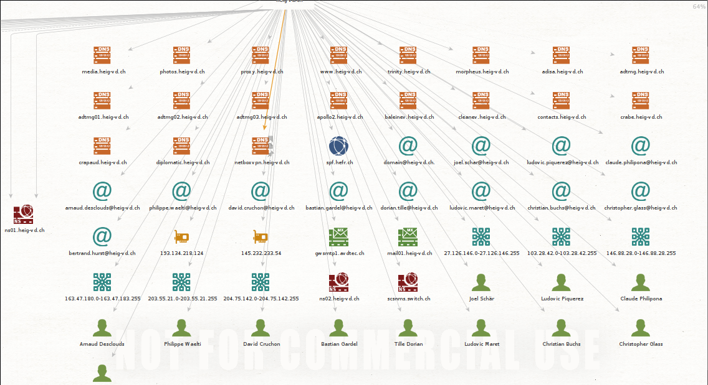

Dans mon cas, j'ai aussi utilisé le domaine de l'école. Nous pouvons aussi remarquer que les mêmes informations sont les mêmes que celles trouvées dans l'énoncé.

 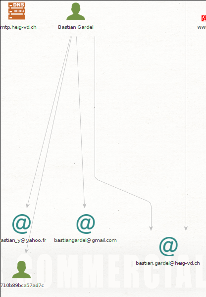

### Recherche d'une identité

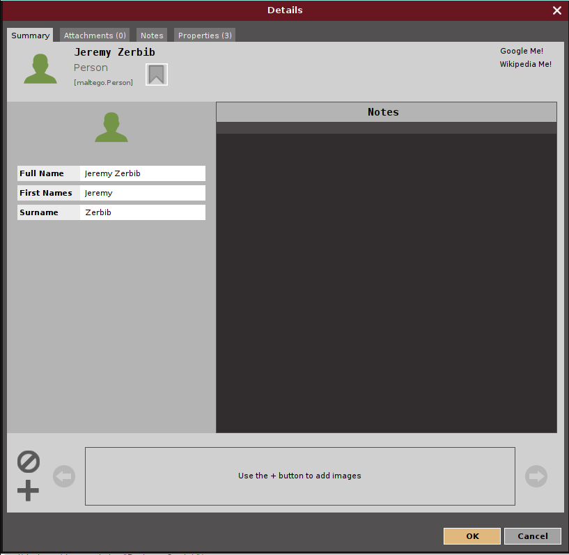

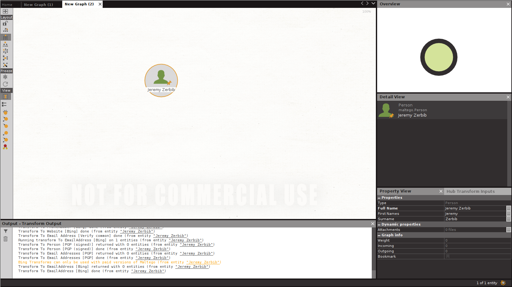

Nous pouvons voir que rien n'est trouvé avec mon nom.

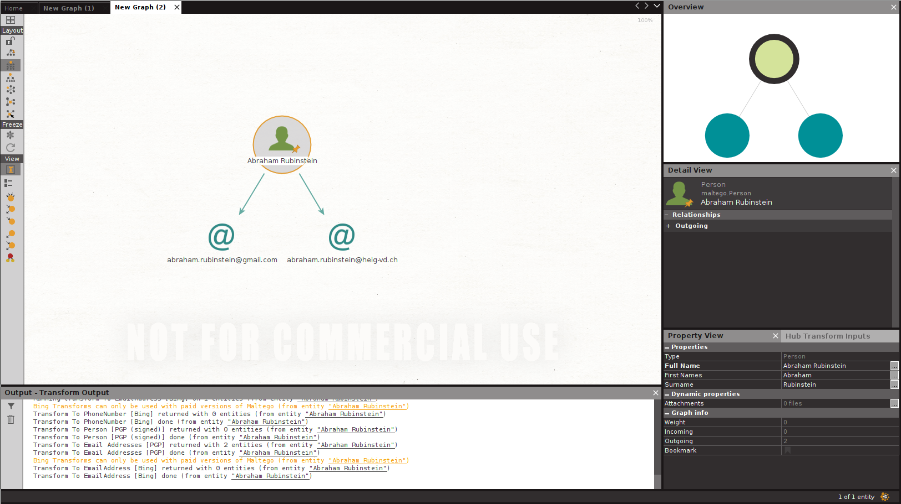

Avec Abraham Rubinstein, nous trouvons la même chose que dans la donnée.

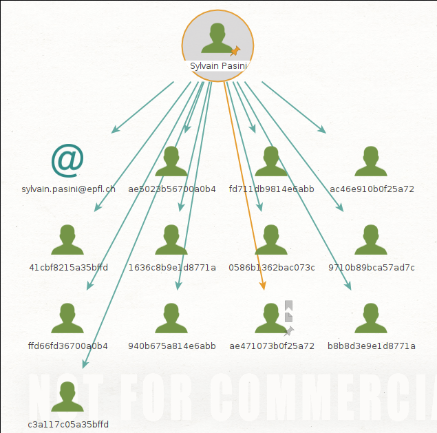

Avec Sylvain Pasini, nous trouvons l'arbre suivant.

### Recherche d'une adresse email

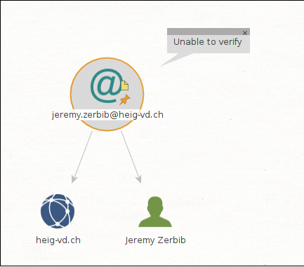

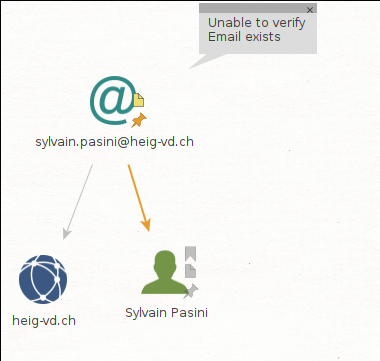

Dans les deux cas, aucune certitude n'est possible quant à la véracité de l'information obtenue.

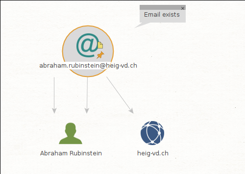

Dans le cas d'Abraham Rubinstein, il est possible d'établir avec certitude que l'email existe.

### Installation et utilisation de nouvelles transformations

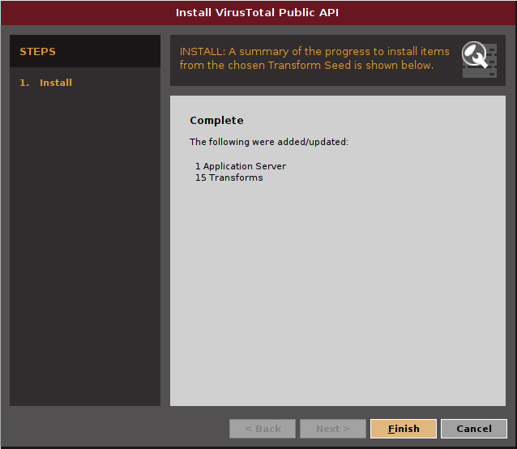

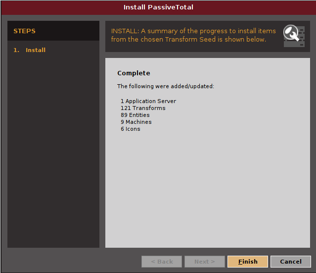

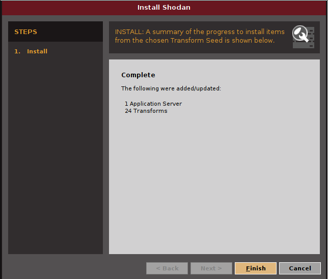

Toutes les transforms ont été installées correctement. 

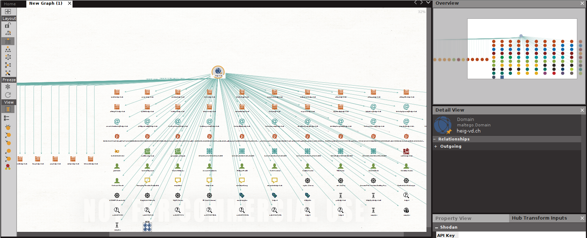

Nous pouvons voir que beaucoup plus de liens ont été trouvés 

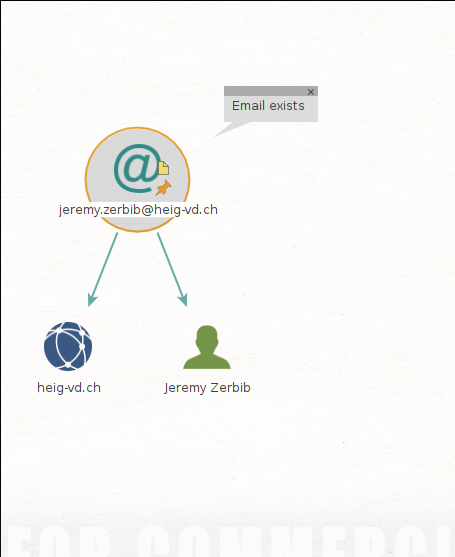

Nous pouvons voir que les informations trouvées restent les mêmes à la différence près que l'email existe de façon certaine.

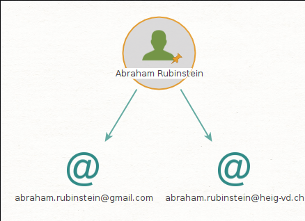

Pour les personnes, nous trouvons exactement les mêmes informations.

### Et maintenant ?

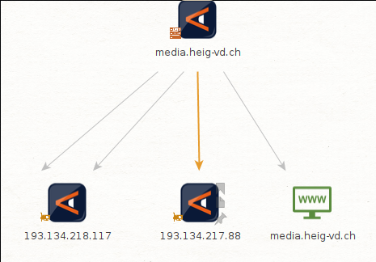

Dans ce cas, les résultats ne sont pas trop difficiles à gérer. En effet, la quantité d'information n'est pas trop importante donc facilement gérable.

On retrouve des informations utiles avec les adresses IP distinctes d'un serveur. Le serveur est issu de l'analyse du domaine *heig-vd.ch*.